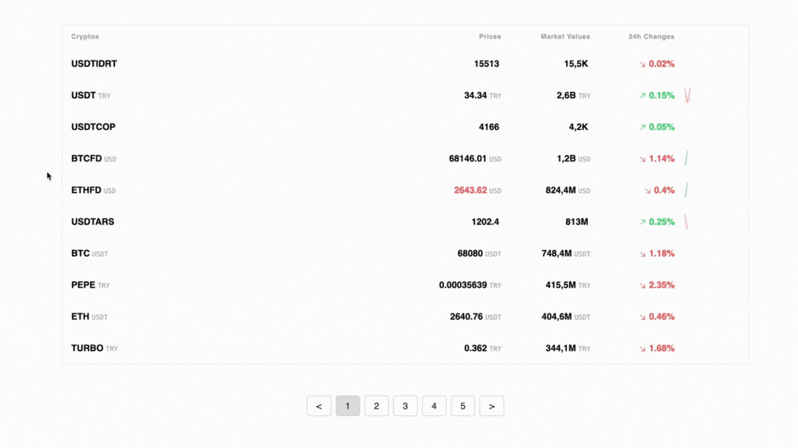

# cryptoApp

This app is a web application that tracks real-time prices and changes of cryptocurrencies using the Binance API. Users can monitor prices, market values, and 24-hour change percentages of popular cryptocurrencies in real-time. Additionally, users can view price changes in graphical charts.

## Libraries

- **React:** For building the user interface.
- **TypeScript:** For writing more secure and maintainable code.
- **Tailwind CSS:** For styling.
- **WebSocket:** For real-time data streaming.
- **Axios:** For making API calls.
- **React Sparklines:** For graphical representation of data.
- **React Paginate:** For pagination.
- **React Icons:** For adding icons.
- **Millify:** For formatting large numbers into readable formats.

## Features

- **Color-Coded Change Display:** Highlights price changes in green (increase) or red (decrease) in real time.
- **Real-Time Price Tracking:** Displays real-time prices and market values of cryptocurrencies using the Binance API.
- **Graphical Representation:** Allows users to visualize price changes over time with graphical charts.
- **24-Hour Change:** Shows the 24-hour percentage changes and price rates of cryptocurrencies.
- **Pagination:** Lists cryptocurrencies in a user-friendly manner with pagination for easier navigation.

## GIF

